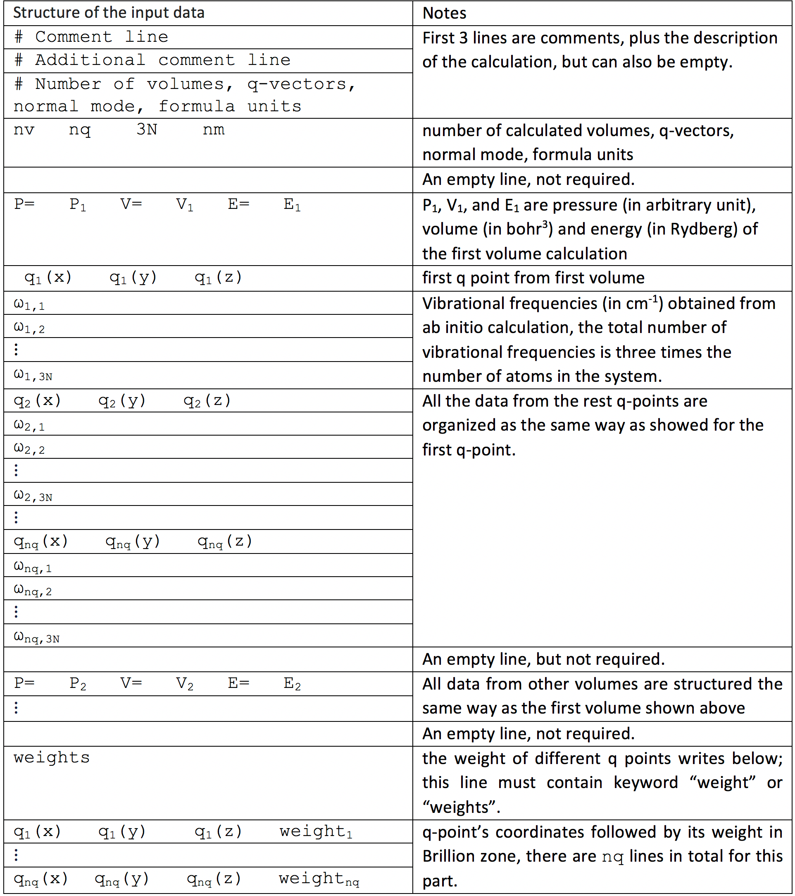

Run calculation command: ``qha-run``
************************************

How to make settings
====================

First you need to prepare a standard input file and a YAML file specifying
your computational settings, which by default is named ``settings.yaml``.
Please refer to `this webpage <https://docs.ansible.com/ansible/latest/reference_appendices/YAMLSyntax.html>`_
if you are not familiar with YAML syntax.

Here are some keys that can be specified in ``settings.yaml``:

* ``NT``: Number of temperatures on the grid
* ``DT``: The interval between two nearest temperatures on the grid
* ``NTV``: Number of volumes (or equivalently, pressure) on the gird
* ``DELTA_P``: The interval between two pressures on the grid, default value is :math:`0.1` GPa
* ``DELTA_P_SAMPLE``: Pressure-sampling interval, used for output, default value is :math:`1` GPa
* ``P_MIN``: Desired minimum pressure to calculate, in GPa
* ``input``: Name of the input file(s). The value here determines the calculation type is single- or multi- configuration calculation

  * In the single-configuration calculation, only the name of the file is needed,
  * In the multi-configuration calculation, the names of the inputs files and the corresponding configuration 
  degeneracy are given in a YAML dictionary.

  The code will recognize the organization of the input and choose the calculation module accordingly.
* ``same_phonon_dos``: Determine whether use the same phonon dos for all configurations, ``True`` or ``False`` (default)
* ``static_only``: Whether to include only static energy in the calculation, ``True`` or ``False`` (default)
* ``order``: Order of Birch–Murnaghan Equation of State fitting, ``3`` (default), ``4`` or ``5``
* ``energy_unit``: Energy unit in the output file can be ``ry`` (default) or ``ev``
* ``calculate``: Determines which properties will be calculated.

  * ``F``, Helmholtz free energy
  * ``G``, Gibbs free energy
  * ``U``, internal energy
  * ``H``, enthalpy
  * ``V``, volume
  * ``Cp``, pressure specific heat capacity
  * ``Cv``, volumetric specific heat capacity
  * ``Bt``, isothermal bulk modulus
  * ``Btp``, derivative of the isothermal bulk modulus with respect to pressure
  * ``Bs``, adiabatic bulk modulus
  * ``alpha``, thermal expansion coefficient
  * ``gamma``, thermal Grüneisen parameters

* ``target``: Default value is ``parallel``. 
  This is a Numba package option. Allowed options are ``cpu`` (used on single-threaded CPU), ``parallel`` (used on multi-core CPU), 
  and ``cuda`` (used on CUDA GPU).
* ``results_folder``: The path to store all calculated values, the default value is ``./results``
* ``plot_results``: Plot all physic properties in PDF format, ``True`` or ``False`` (default)
* ``T4FV``: Temperature for F versus V plotting. ``['0', '300']`` is default 
* ``high_verbosity``: Two verbosity levels are implemented, ``True`` or ``False`` (default)

How to make input data
======================

The input format is as below:

After you have prepared ``settings.yaml`` and ``input`` in the same directory,
just open your terminal, redirect to that directory and run::

   $ qha-run settings.yaml

then the results will be generated in the directory specified
in ``results_folder`` option.

Output
======

The output files' names and their meanings are as below:

* Helmholtz free energy: ``f_tp_ry.txt`` or ``f_tp_ev.txt``
* Gibbs free energy: ``g_tp_ry.txt`` or ``g_tp_ev.txt``
* Enthalpy: ``h_tp_ry.txt`` or ``h_tp_ev.txt``
* Volume: ``v_tp_bohr3.txt`` or ``v_tp_ang3.txt``
* Pressure-specific heat capacity: ``cp_tp_jmolk.txt``
* Volume-specific heat capacity: ``cv_tp_jmolk.txt``
* Isothermal bulk modulus: ``bt_tp_gpa.txt``
* Derivative of the isothermal bulk modulus with
  respect to pressure: ``btp_tp.txt``
* Adiabatic bulk modulus: ``bs_tp_gpa.txt``
* Thermal expansion: ``alpha_tp.txt``
* Thermal Grüneisen parameters: ``gamma_tp.txt``
